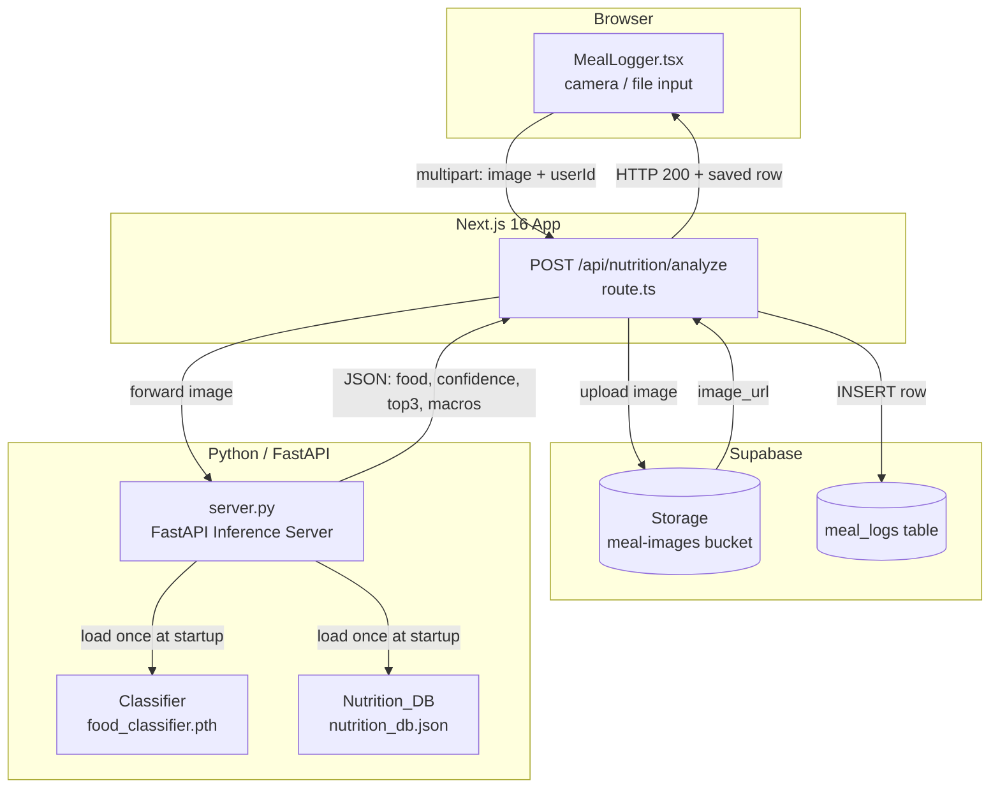

# Design Document: food-recognition-ml

## Overview

This feature replaces the existing mock photo-analysis flow in the fitnessandifree Next.js 16 app with a fully-owned, on-premises ML pipeline. A fine-tuned EfficientNetV2-S model classifies food images into 101 Food-101 categories, looks up per-100 g macros from a bundled USDA-sourced JSON database, and returns structured macro estimates. A FastAPI inference server bridges the Python model and the Next.js API route. Results are persisted to Supabase and surfaced through a revised `MealLogger` component.

The system is intentionally offline-first at inference time: once the model weights and `nutrition_db.json` are built, no third-party API calls are needed during request serving.

---

## Architecture



**Data flow summary:**
1. Browser sends image + userId as multipart POST to the Next.js API route.
2. API route uploads the image to Supabase Storage (`meal-images` bucket) and obtains the storage path.
3. API route forwards the image bytes to the FastAPI inference server.
4. FastAPI server runs the classifier, looks up macros, and returns structured JSON.
5. API route inserts the result + `image_url` into `meal_logs`.
6. API route returns the saved row to the browser.
7. MealLogger updates Zustand state and invalidates the React Query `["meal-logs"]` key.

---

## Components and Interfaces

### ML Layer (`ml/`)

| File | Purpose |
|---|---|
| `train.py` | Two-phase fine-tuning of EfficientNetV2-S on Food-101 |
| `evaluate.py` | Measures top-1 accuracy on the Food-101 test split |
| `build_nutrition_db.py` | Queries USDA FoodData Central API once; writes `nutrition_db.json` |
| `server.py` | FastAPI inference server exposing `POST /analyze` |
| `food_classifier.pth` | Serialized PyTorch model weights (produced by `train.py`) |
| `nutrition_db.json` | Pre-built macro database (produced by `build_nutrition_db.py`) |
| `requirements.txt` | Pinned Python dependencies |
| `ALGORITHMS.md` | Technical reference for design decisions |

#### `POST /analyze` — FastAPI endpoint

Request (multipart form):
```
image: File   # jpeg / png / webp, ≤ 10 MB
```

Success response (HTTP 200):
```json
{
  "food": "pizza",
  "confidence": "87.43",
  "top3": [
    { "name": "pizza",         "confidence": "87.43" },
    { "name": "french_fries",  "confidence": "7.21"  },
    { "name": "tiramisu",      "confidence": "2.11"  }
  ],
  "macros": {
    "calories":  285.00,
    "protein_g":  12.50,
    "carbs_g":    35.20,
    "fat_g":      10.80,
    "fiber_g":     2.10
  },
  "low_confidence": true   // only present when confidence < 50 %
}
```

Error responses:
- `HTTP 422` — file size > 10 MB or MIME type unsupported, with body identifying which constraint failed
- `HTTP 422` — top-1 category absent from Nutrition_DB
- `HTTP 500` — unexpected server error

### Next.js API Route (`app/api/nutrition/analyze/route.ts`)

Accepts `POST` with multipart body:
```
image:  File    # jpeg / png / webp, ≤ 10 MB
userId: string  # non-empty
```

Pipeline (sequential, fails fast):
1. Validate `image` and `userId` → `400` on failure
2. Upload image to Supabase Storage → `502` on failure
3. Forward image to `ML_MODEL_URL/analyze` → `503` on failure
4. Insert row into `meal_logs` → `500` on failure
5. Return `200` with the saved row

Reads from environment variables (Next.js 16 style — never hardcoded):
- `ML_MODEL_URL`
- `SUPABASE_URL`
- `SUPABASE_SERVICE_KEY`

> **Next.js 16 note:** All dynamic request APIs (`cookies()`, `headers()`) are fully async and must be awaited. `formData()` is read directly from the `Request` object via `request.formData()`. There is no `bodyParser` configuration needed in the App Router.

### MealLogger Component (`components/nutrition/MealLogger.tsx`)

Client Component (`"use client"`). Replaces the existing mock photo flow in the current `MealLogModal` (photo mode).

State machine:

```
idle
  ↓ (image selected)
image-selected
  ↓ (Analyse Meal clicked)
analysing  ← button disabled + spinner
  ↓ success                  ↓ error
result-shown              error-shown  ← image retained, button re-enabled
  ↓ (Log Meal confirmed)
logging
  ↓ success
idle  ← reset to initial state
```

Props interface:
```typescript
interface MealLoggerProps {
  userId: string;
  onSuccess?: (row: MealLogRow) => void;
}
```

Integrations:
- `useNutritionStore().addFood({ calories, protein, carbs, fat })` — called on confirm
- `useQueryClient().invalidateQueries({ queryKey: ["meal-logs"] })` — called on confirm

### Zustand Store (`lib/store/nutrition.ts`)

No schema changes required. The existing `addFood(entry: MacroEntry)` action already accepts `{ calories, protein, carbs, fat }`. The component maps API response fields:
```typescript
addFood({
  calories: result.macros.calories,
  protein:  result.macros.protein_g,
  carbs:    result.macros.carbs_g,
  fat:      result.macros.fat_g,
})
```

### Supabase Schema (`supabase/migrations/create_meal_logs.sql`)

See Data Models section below.

---

## Data Models

### `nutrition_db.json` — per-entry schema

```json
{
  "pizza": {
    "calories":   266.0,
    "protein_g":   11.0,
    "carbs_g":     33.0,
    "fat_g":       10.0,
    "fiber_g":      2.3,
    "serving_size": 107
  }
}
```

All 101 Food-101 category names are top-level keys. All five macro fields are always present; value may be `null` if USDA data was unavailable after 3 retries. `serving_size` is always a positive integer in `[1, 2000]`.

### `meal_logs` Supabase table

```sql
CREATE TABLE IF NOT EXISTS meal_logs (
  id          UUID          PRIMARY KEY DEFAULT gen_random_uuid(),
  user_id     TEXT          NOT NULL,
  logged_at   TIMESTAMPTZ   DEFAULT now(),
  meal_name   TEXT,
  confidence  NUMERIC(4,2)  CHECK (confidence >= 0.00 AND confidence <= 1.00),
  calories    NUMERIC(10,2),
  protein_g   NUMERIC(10,2),
  carbs_g     NUMERIC(10,2),
  fat_g       NUMERIC(10,2),
  fiber_g     NUMERIC(10,2),
  image_url   TEXT
);

CREATE INDEX IF NOT EXISTS idx_meal_logs_user_time
  ON meal_logs (user_id ASC, logged_at DESC);
```

The `confidence` column stores the raw 0–1 float from the ML response (not the percentage string). The API route divides the displayed percentage by 100 before inserting.

### `MealLogRow` TypeScript type

```typescript
interface MealLogRow {
  id:         string;
  user_id:    string;
  logged_at:  string;   // ISO-8601 timestamptz
  meal_name:  string | null;
  confidence: number | null;  // 0.00 – 1.00
  calories:   number | null;
  protein_g:  number | null;
  carbs_g:    number | null;
  fat_g:      number | null;
  fiber_g:    number | null;
  image_url:  string | null;
}
```

### ML model training — hyperparameters

| Parameter | Phase 1 | Phase 2 |
|---|---|---|
| Backbone | Frozen | Unfrozen |
| Epochs | 5 | 10 |
| Learning rate | 1e-3 | 1e-4 |
| LR schedule | Constant | CosineAnnealingLR |
| Loss | CrossEntropyLoss | CrossEntropyLoss |
| Optimizer | Adam (weight_decay=1e-4) | Adam (weight_decay=1e-4) |
| Accuracy target | — | ≥ 85 % top-1 |
| Max extra epochs | — | 50 (in 5-epoch increments) |

Phase 2 LR (1e-4) is exactly 1/10 of phase 1 LR (1e-3), satisfying Requirement 1.3.

---

## Correctness Properties

*A property is a characteristic or behavior that should hold true across all valid executions of a system — essentially, a formal statement about what the system should do. Properties serve as the bridge between human-readable specifications and machine-verifiable correctness guarantees.*

The feature contains testable business logic in three areas: (1) macro scaling math in the inference server, (2) input validation and error routing in the Next.js API route, and (3) UI state management in `MealLogger`. Property-based testing applies to all three.

**Property reflection:** After reviewing the prework, several properties are consolidated:
- Requirements 3.3 and 3.6 both cover file-rejection logic (size + MIME type); merged into Property 3.
- Requirements 6.3 and 6.4 both cover image-selection UI state; merged into Property 5.
- Requirements 6.9 and 6.11 are both post-confirm state transitions; kept separate because they validate different concerns (store update vs. component reset).

---

### Property 1: Macro scaling is proportional to serving size

*For any* food category in Nutrition_DB with non-null macro values and any valid image input that classifies to that category, the macros in the `/analyze` response must equal the per-100 g values multiplied by `(serving_size / 100)`, rounded to two decimal places.

**Validates: Requirements 3.4, 2.3**

---

### Property 2: Low-confidence flag is set iff top-1 score is below 50 %

*For any* classifier output, `low_confidence: true` appears in the response if and only if the top-1 confidence score is strictly less than 0.50. For scores ≥ 0.50 the field is absent from the response JSON entirely.

**Validates: Requirements 3.5**

---

### Property 3: Invalid uploads are rejected with HTTP 422

*For any* uploaded file whose MIME type is not one of `image/jpeg`, `image/png`, `image/webp`, or whose byte size exceeds 10 MB, the `/analyze` endpoint returns HTTP 422 with a body that explicitly identifies the rejection reason (size or type).

**Validates: Requirements 3.3, 3.6**

---

### Property 4: API route returns 400 for any invalid input combination

*For any* POST to `/api/nutrition/analyze` where either `image` is absent, `image` has an unsupported MIME type, `image` exceeds 10 MB, or `userId` is an empty/missing string, the route returns HTTP 400 with a descriptive error message.

**Validates: Requirements 4.1**

---

### Property 5: MealLogger button state tracks image selection

*For any* MealLogger state, the "Analyse Meal" button's `disabled` attribute is `true` if and only if no image file is currently selected. Conversely, whenever a valid image file is selected, the button transitions to enabled and a preview is rendered.

**Validates: Requirements 6.3, 6.4**

---

### Property 6: MealLogger renders complete macro breakdown for any valid API response

*For any* valid API response (containing `food`, `confidence`, and `macros` with all five fields), the rendered MealLogger output contains: the food name string, the confidence rounded to a whole number in [0, 100], and all five macro values (calories, protein_g, carbs_g, fat_g, fiber_g).

**Validates: Requirements 6.6**

---

### Property 7: Low-confidence responses always render Top3 selectable alternatives

*For any* API response where `low_confidence: true`, the MealLogger renders all three alternatives from `top3` as individually selectable options before showing the "Log Meal" button.

**Validates: Requirements 6.7**

---

### Property 8: Store update maps API response fields correctly

*For any* confirmed meal result with macro values `(calories, protein_g, carbs_g, fat_g)`, calling "Log Meal" invokes `useNutritionStore.addFood` with exactly `{ calories, protein: protein_g, carbs: carbs_g, fat: fat_g }`.

**Validates: Requirements 6.9**

---

### Property 9: Successful log resets MealLogger to initial state

*For any* meal log sequence (image selected → analysed → confirmed), after the API route returns success the MealLogger component state is identical to its initial state: no image selected, no preview, no result displayed, no error shown.

**Validates: Requirements 6.11**

---

### Property 10: API errors preserve image and re-enable button

*For any* API error response (4xx or 5xx), the MealLogger retains the previously selected image (preview still visible), re-enables the "Analyse Meal" button, and renders a non-empty human-readable error message.

**Validates: Requirements 6.12**

---

### Property 11: Nutrition DB entries always contain all macro keys

*For any* entry in `nutrition_db.json`, all five keys (`calories`, `protein_g`, `carbs_g`, `fat_g`, `fiber_g`) are present in the object. Values may be `null`, but the keys must not be omitted.

**Validates: Requirements 2.2**

---

### Property 12: Training accuracy retry loop terminates correctly

*For any* sequence of accuracy readings where the threshold of 0.85 is not met within the base epochs, the training loop continues in increments of exactly 5 additional epochs and exits with a non-zero code if and only if the threshold is not reached after 50 total additional epochs.

**Validates: Requirements 1.6**

---

## Error Handling

### FastAPI inference server

| Condition | HTTP Status | Behaviour |
|---|---|---|
| File > 10 MB | 422 | Body: `"Rejected: file size exceeds 10 MB"` |
| Unsupported MIME type | 422 | Body: `"Rejected: unsupported file type <type>"` |
| Category not in Nutrition_DB | 422 | Body: `"Unrecognized category: <name>"` |
| Model file missing at startup | Non-zero exit | Log error with path |
| Nutrition_DB missing/malformed at startup | Non-zero exit | Log error with path and failure type |
| Unexpected exception | 500 | Log stack trace; return generic error body |

### Next.js API route

| Condition | HTTP Status | Behaviour |
|---|---|---|
| Missing/invalid `image` or `userId` | 400 | Descriptive body |
| Supabase Storage upload failure | 502 | `"Storage upload failed"` |
| ML server unreachable or non-2xx | 503 | `"ML inference service unavailable"` |
| `meal_logs` insert failure | 500 | `"Database insert failed"` |
| Success | 200 | Saved `MealLogRow` as JSON |

### MealLogger component

- **During analysis:** button is disabled and shows a spinner; no user action is possible.
- **On error:** error message rendered inline below the image preview; image retained; button re-enabled. The error message text comes from the API response body if available, otherwise a generic fallback.
- **On success:** component resets to idle state; `addFood` and `invalidateQueries` are called before the reset so the rest of the UI reflects the new data.

### build_nutrition_db.py

- Retries each USDA label up to 3 times before recording `null`.
- Logs a warning for each label that falls back to `null`.
- Exits with non-zero code if any category has **all five** macro fields set to `null` (partial nulls are allowed).

---

## Testing Strategy

### Python ML layer

**Unit tests** (pytest):
- `test_freeze_phase`: assert backbone `requires_grad == False` after phase-1 freeze; head `requires_grad == True`.
- `test_unfreeze_phase`: assert all parameters `requires_grad == True` after phase-2 unfreeze.
- `test_lr_relationship`: assert `phase2_lr <= phase1_lr / 10`.
- `test_scheduler_type`: assert scheduler is `CosineAnnealingLR`.
- `test_retry_logic`: mock USDA API to fail 0, 1, 2, 3 times; assert correct call count.
- `test_nutrition_db_all_null_exit`: assert script exits non-zero when all macros are null for any entry.

**Property-based tests** (Hypothesis, minimum 100 iterations each):
- **Property 1** — Macro scaling: generate random `(per_100g_values, serving_size)` tuples; assert scaled response matches formula.
- **Property 2** — Low-confidence flag: generate random confidence float in [0, 1]; assert flag present iff < 0.50.
- **Property 3** — File rejection: generate files with random MIME types and sizes; assert 422 for invalid combinations.
- **Property 11** — Nutrition DB key presence: generate random nutrition entries; assert all five macro keys present.
- **Property 12** — Retry loop: generate random accuracy sequences; assert loop terminates correctly.

  Tag format: `# Feature: food-recognition-ml, Property <N>: <property text>`

**Integration tests:**
- Start server with valid model and DB; assert `POST /analyze` succeeds end-to-end.
- Start server with missing model file; assert non-zero exit.
- Start server with malformed `nutrition_db.json`; assert non-zero exit.
- CORS header present on all responses.

### Next.js API route

**Unit/property-based tests** (Vitest + fast-check, minimum 100 iterations):
- **Property 4** — Input validation: generate arbitrary combinations of missing/invalid fields; assert 400.
- **Property 8** — Store field mapping: generate arbitrary ML response objects; assert `addFood` called with correct field mapping.

**Integration tests** (mock Supabase and ML server):
- Happy path: valid image + userId → 200 with saved row.
- Storage failure → 502.
- ML server 503 → 503.
- DB insert failure → 500.

### MealLogger component

**Property-based tests** (Vitest + React Testing Library + fast-check, minimum 100 iterations):
- **Property 5** — Button/preview state tracks image selection.
- **Property 6** — Complete macro breakdown rendered for any valid response.
- **Property 7** — Top3 rendered for any `low_confidence: true` response.
- **Property 9** — Component resets after successful log.
- **Property 10** — Error state preserves image and re-enables button.

**Example-based unit tests:**
- Camera input renders with `capture="environment"`.
- Spinner shown during pending state.
- "Log Meal" button present only after result is shown.
- `queryClient.invalidateQueries(["meal-logs"])` called on confirm.

### Supabase migration

- Run migration twice against a test Supabase instance; assert second run succeeds (idempotency).
- Assert all columns exist with correct types post-migration.

---

## Research Findings

**EfficientNetV2-S architecture choice** (supporting Requirement 7):
EfficientNetV2-S achieves ~84 % top-1 on ImageNet-1K with ~20 M parameters and significantly faster training speed than its larger variants due to Fused-MBConv blocks in early stages. Against the stated alternatives:
- **EfficientNetV2-M**: ~2× slower training, ~85 M ops more, with marginal accuracy gain on a 101-class problem — cost/benefit doesn't justify it.
- **ResNet-50**: Older compound scaling; EfficientNetV2-S is consistently more accurate per FLOP at this scale.
- **ViT-B/16**: Requires much larger datasets and longer training schedules to converge; Food-101 (101K images) is too small for the attention-only architecture to outperform CNNs without heavy augmentation or larger pre-training.

**USDA FoodData Central API**: Returns SR Legacy and Foundation Foods nutrients. Per-100 g nutrient mapping: Energy (kcal) → `calories`, Protein → `protein_g`, Carbohydrate, by difference → `carbs_g`, Total lipid (fat) → `fat_g`, Fiber, total dietary → `fiber_g`.

**Supabase JS client in Next.js 16**: Use `@supabase/supabase-js` with `createClient` using `SUPABASE_SERVICE_KEY` (service role) in the API route. The `supabase.storage.from('meal-images').upload(path, buffer)` call returns a signed URL via `.createSignedUrl(path, expiresIn)` with validity 1–3600 s. No server-side cookie handling is needed for service-role API routes.

**React Query v5 cache invalidation**: `useQueryClient().invalidateQueries({ queryKey: ["meal-logs"] })` is the v5 API (object argument replaces the v4 positional array argument).

**Property-based testing libraries**:
- Python: [Hypothesis](https://hypothesis.readthedocs.io/) — the standard for Python PBT.
- TypeScript: [fast-check](https://fast-check.dev/) — mature, Vitest-compatible arbitraries.
